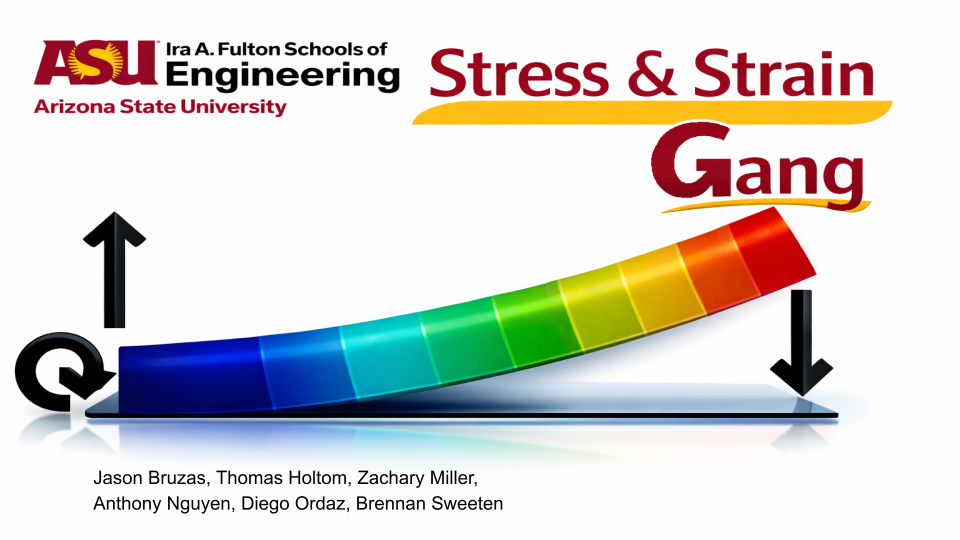
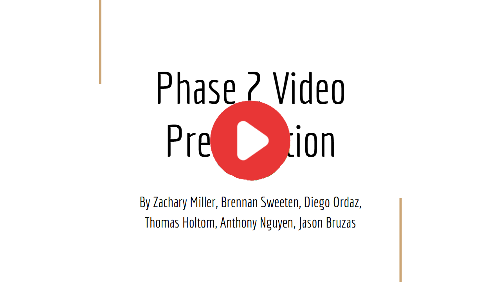

# Hydraulic Robotic Arm
***Stress and Strain Gang***

*Jason Bruzas, Thomas Holtom, Zachary Miller, Anthony Nguyen, Diego Ordaz, Brennan Sweeten*

## Table of Contents
### [Phase 1](#phase-1-1)

[*Phase 1 Video*](#phase-1-video)

[*Executive Summary*](#executive-summary)

[*System description and functional overview*](#System-description-and-functional-overview) 

[*Component breakdown with labeled figures/sketches*](#component-breakdown-with-labeled-figuressketches)

[*Kinematic description and basic calculations*](#kinematic-description-and-basic-calculations)

[*Preliminary failure modes and design considerations*](#preliminary-failure-modes-and-design-considerations)

[*References for any external material (manuals, patents, data sheets, etc.)*](#references-for-any-external-material-manuals-patents-data-sheets-etc)

### [Phase 2](#phase-2-1)
[*Phase 2 Video*](#Phase-2-Video)

[*Overview of your final design*](#Overview-of-the-Final-Design)

[*Description of major design decisions and changes from Phase 1*](#Major-Design-Decisions-and-Changes-from-Phase-1)

[*Detailed explanation of required analyses*](#Explanation-of-Required-Analyses)

[*Discussion of design for assembly*](#Discussion-of-Design-for-Assembly)

[*Updated list of anticipated risks and weaknesses*](#Updated-List-of-Anticipated-Risks-and-Weaknesses)

### Phase 3
*Phase 3 Video*

*Fabrication details (filament type, printer, settings, number of reprints)*

*Assembly procedure and challenges*

*Test procedures, results, and interpretation*

*Comparison with Phase 2 predictions (where applicable)*

*Detailed discussion of failures, mistakes, and surprises*

*Concrete list of design changes you would implement in a second iteration*

## Phase 1
### Phase 1 Video

### Executive Summary 
The purpose of the phase 1 report includes the system functionality and components, kinematic calculations, preliminary failure mode review, critical design parameters, and a YouTube video that summarizes the project. 

The groups are tasked with choosing a mechanical system to design, model, and test. This is meant for students to apply their knowledge of mechanical engineering that they have learned up to this point to a real project. This both allows students to get some experience of how engineering is done in the real world and allows them to better understand the engineering concepts that go into making their designs. This mechanical system must be suitably complex so that every single group member is able to contribute but simple enough that each phase of the project can be completed on time. 

The mechanical system chosen to be studied was that of a hydraulic arm. The use of hydraulics is a cornerstone of many civil engineering and robotics projects, so understanding them is of key importance to mechanical engineers. The hydraulic arm chosen has 2 degrees of freedom because it has two hydraulics that control the position of the arm. These two degrees of freedom make the hydraulic arm suitably complex enough that CAD software and a lot of manpower is needed to fully understand the kinematics and statics of the arm. Thus, a hydraulic arm is excellent for fulfilling the criteria of the project being suitably complex; here, each group member contributes, and it teaches how to apply hydraulics to a real engineering problem. 

The plan after the phase 1 report is completed is to immediately start creating CAD models of the hydraulic arm so the design process can begin. From this, the specification of each component can be fully identified, and the kinematics and statics of the CAD models can be analyzed using FEM to see if the ideas work in theory. The CAD models will be designed in Solidworks or Ansys, with the FEM being handled by Ansys. 

### System description and functional overview
Robotic arms have many uses in manufacturing and assembly. They are used for repetitive tasks like welding, sorting, or milling. These tasks are often done automatically. To be able to assist in or perform these tasks, the arm needs to pick up, maneuver, move, and hold items. For the purpose of this project, the robotic arm should be able to pick up and hold a 1-kilogram object and will move via hydraulic power. The robotic arm will have three main segments: the base, the upper arm, and the forearm. The top two segments will have hydraulics attached to control the angles of each arm.

### Component breakdown with labeled figures/sketches
#### Claw

In the initial stages of sketching the design for the claw subsystem, the main issue that presented itself was the angle at which the hand-like component would grip an object in the main operating event. The initial design consisted of an angled grip system, allowing the claw to wrap the linkages around the side of an object. This was ultimately rejected due to the fundamental issue of objects slipping out before full closure. Instead, a more favorable design was considered with an ingenious solution: a two-bar system that can allow the claw to open horizontally with the linear motion of a controlled hydraulic.

*Initial concept drawing of claw subsystem*

*Pre-design drawing of claw subsystem with two-bar mechanism*

#### Hydraulic

The hydraulic subsystem is a key component for the hydraulic arm system to function. It must provide the capability for consistent extension and retraction in a linear direction for actuation of the arm member rotations. The hydraulic was modeled after standard fluid input/output hydraulics and features the hydraulic barrel, fluid extension and retraction ports, piston, and piston rod as the main composition of the design chosen to perform the tasks needed for operating the hydraulic arm. In total, 3 hydraulic cylinders are necessary for the proper functions of the arm, including rotary motion in the main joints and claw subsystem.

*Pre-design drawing of hydraulic subsystem*

### Kinematic description and basic calculations
There will be two arm segments that can rotate independently, giving the arm two degrees of freedom in the position of the claw.

The position of the claw can be obtained from the lengths of the hydraulics using cosine law and trivial trigonometry relationships. However, determining appropriate hydraulic lengths based on desired claw position is a much more difficult task, requiring the inverse of the prior equations. This is difficult because isolating the hydraulic lengths requires rigorous application of trigonometric identities. These calculations are necessary for automatic robotic arms, but not for manual control, as the operator is able to adjust the hydraulics through trial and error. 

By assuming that the system is undergoing quasi-static equilibrium and that the hydraulics only have axial forces going through them, it is possible to create a system of linear equations to solve for the forces on the fixed end at the bottom, the forces on the two internal pins of the arm, and the internal force in the hydraulics. In conjunction with the kinematic calculations from earlier, one can predict the forces within the hydraulic arm when knowing the lengths of the members, the positions of the hydraulics, the mass of the system, the mass of the weight picked up by the claw, and the current length of the hydraulics. The Free Body diagrams from this calculation can be seen below: 

Note: The variable names between the Kinematic and Statics calculations will vary as they were done by two separate people. 

After getting the linear system of equations from the statics calculations, MATLAB was used to solve the system by substituting in reasonable values for each of the unknown constants. From this analysis, it was determined that the bottom hydraulic and the left-most pin experience the two highest forces out of any component, making these two components the most likely to fail due to static overload failure. The statics caluation work and the MATLAB code can be accessed below. 

Statics Calculation work: https://drive.google.com/file/d/1Ut7OGnmQNidH3Am7ShedRqDdGQ3p2LGb/view?usp=sharing

MATLAB Code: https://drive.google.com/file/d/1DJdaTfVr9Ji7mV_dZBP7UAXajvhnQ-qj/view?usp=sharing

### Preliminary failure modes and design considerations
The failure can happen at the pinned joints, for the cut-out of the holes in the beams can cause stress concentrations. Using the wrong pins or sizing can drastically affect the performance of the hydraulic arm. For example, a severe form of adhesive wear known as galling damage can cause the pins and bearings to tear due to high pressure and friction, causing wear failure. Without proper maintenance, this can cause the hydraulic arm to stiffen until it can no longer move, effectively making the system useless. What's worse is that the left-most pin also experiences a large amount of force as seen from the statics calculations, so the friction issue will also make static overload failure more likely. 

To ensure that this does not happen, a study conducted by Nader Farzaneh (in his thesis, Failure Analysis and Design of a Heavily Loaded Pin Joint) suggests that an undercut bushing will provide the longest longevity compared to other methods of pin jointing. Other ways to extend the life-time of the pins can be to lubricate the bearings and perform stress concentration calculations to determine where we will drill the hole as well as how large of a hole. Another area that needs to be considered is the motion of the beams. If one of the beams rotates too far, it can snap the hydraulics. Hydraulics are terrible at resisting shear stresses, so they can easily fail due to static overload failure if too much shear force is present. To prevent this, we can put stoppers to limit the area of motion of each of the beams, which minimizs the possible shear forces on the hydraulics.

### Critical design parameters 
Before anything else within the hydraulic arm can be determined, the scale of the arm must be finalized. Any research into hydraulics, plastics, or pins would be worthless if the arm lengths change midway through the project. Thus, the arm lengths must be finalized before anything else can be done. Next is studying what plastic should be used as the material for the prototype. Material properties like density, Young’s modulus, and shear modulus will determine how much plastic can be used in the arm and what is the maximum force that the plastic can handle. The plastic also has to be 3D printed, so a 3D-printable plastic has to be chosen to fit this task as well. 

Since there is likely no suitable way to design and 3D print a hydraulic, hydraulics will have to be scouted for online. Since the arm lengths and the plastic have been chosen already, the size of the hydraulics and the forces they have to exert will be well known. The hydraulics will be chosen based on the criteria of cost, maximum force it can exert, and size. Finally the pin design will be finalized. The arm lengths and type of plastic used will determine what forces the pins must be able to exert in order for the hydraulic arm to function. Thus, the type of pins used, the location of the pins, and the size of the pins will be determined in this step in order to minimize the amount of friction in the joint and to minimize the maximum force the pins must resist. 

### References for any external material (manuals, patents, data sheets, etc.)
https://www.nextengineers.org/sites/default/files/resources/hydraulic_robot_arm.pdf
https://hackaday.io/project/198164/logs
https://dspace.mit.edu/bitstream/handle/1721.1/89359/51805839-MIT.pdf?sequence=2#:~:text=At%20high%20loads%20and%20low,of%20the%20tests%20are%20presented.

## Phase 2 
### Phase 2 Video

### Overview of the Final Design
A hydraulic arm was created using SolidWorks and ANSYS. The choice of using two different softwares comes from the different analyses that both of these softwares can do. With SolidWorks, it can do simple FEA calculations, and its software allows ease of creating components and assembling the components together. On the other hand, ANSYS can do complex FEA calculations and provide a more detailed analysis on how the structure reacts under stress. With both of these softwares in mind, the decision came down to assembling and analyzing the full hydraulic arm in SolidWorks, and then do a more in-depth analysis on each of the components using ANSYS. Images of the assembly isometric view, the assembly exploded view, and each of the components can be found below: 

Hydraulic Arm Assembly:

Hydraulic Arm Exploded View: 

Claw: 

Hydraulic: 

Base: 

Middle Arm:

Midsection: 

Upper Arm:

### Major Design Decisions and Changes from Phase 1

The main design consideration was nailing what the actual scale of the final design should be. This hydraulic arm is intended to be used in a factory or industrial setting to grab objects and boxes from around a meter away. It was reasoned that the arm should be able to pick up objects that are maximum around 200 kg in mass, or around 1962 N in weight. The material of the arm was decided to be an aluminum alloy, specifically the general "aluminum alloy" in ANSYS and 6061 aluminum alloy in SOLIDWORKS. This was done to make the arm cost effective while still being reasonably strong.

The length of the upper and middle arms together should be 20% longer than the intended maximum reach, or around 1.2 m. At the start of phase 1, it was assumed that the two arms were going to be roughly the same length just to make constructing the inital CAD model easier. However, analyzing the system in both SOLIDWORKS and ANSYS determined that the upper arm needs to be shorter than the middle arm. This is due to the fact that there are significant bending stresses in the middle of the upper arm and there is significant deflection at the edge of the claw. Shortening the upper arm to be about 0.75 the size of the middle arm was done to fix the stress and deflection issues. It was eventually chosen that the upper arm should be 0.5135 m long and the middle arm is 0.7 m long. 

To create the claw, the initial concept design was referenced. The concept was designed with a four-bar system that translates linear motion (of a hydraulic) to dual, perpendicular linear motion (of the grippers). The links were designed first with the pin holes in mind for connecting the claw pieces together. Secondary links were made to allow room for the arm upon which the claw is mounted. The gripper was initially designed with a flat face, but was subsequently changed mid-modeling to have a channel that can hold rubber or other adhesive for better grip when the claw is in use.

The final version of the hydraulic arm will use manufacturing grade hydraulics made by wholesellers, but the hydraulic used in the analysis was designed based off of an explanatory guide to hydraulics by Huzhou HUANUO Hydraulic Technology Co.. The design was kept simple to save on computing time and allow us to focus on the strucural integrity of the arm. The hydraulics were designed to be as wide as possible in order to keep the required pressures lower, but manufacturing and industrial hydraulics can handle hudreds of megapascals of pressure, so there was a lot of room for comprimise, when needed. While the model used in the analysis is generic, two types of hydraulic cylinders are to be used in the final design. The arm can be kept simpler by using a single-acting cylinder for the base hydraulic. This means that the hydraulic can only apply either a tension, or compression load, but not both. The base hydraulic is always loaded in tension, so only the bottom segment of the chamber needs to be pressurizes. The other two hydraulics may be loaded in tension or compression depending on the orientation or motion of the arm, so they both need to be double-acting cylinders. 

### Explanation of Required Analyses

There were two analyses done, one in SOLIDWORKS and one in ANSYS. The analysis done in SOLIDWORKS was done on an assembly of the entire claw to identify what the critical angles of the claw are for analysis, the maximum deflection at the claw, the critical areas of stress in the arm were, and to create a motion study. The analysis done in ANSYS was done on each of the critical parts individually to determine if they had a factor of safety of at least 3 for static stresses and at least 2 for fatigue stresses. The static factor of safety was tested by comparing the von Mises stress to the Yield Strength of 6061 aluminum. The fatigue factor of safety was tested by using a zero-based loading, the Goodman mean stress theory, a design life of 1 million cycles, and the von Mises stress.  

SOLIDWORKS was first used to do a static analysis of the hydraulic arm. First, an assembly had to be made of the arm that was fully constraint. Then, this assembly cna be put directly into a static simulation. The base of the hydraulic arm was treated as a fixed support, and a 981 N force was placed on each clamp of the claw to simulate the weight of a 200 kg object. The results of this analysis showed that the highest von Mises stress was 1.722 x 10^8 Pa, or a factor of safety of 1.62 when accounting for 6061 aluminum's Yield Strength of 2.8 x 10^8 MPa. The area that the max stress was present in was the thin portions of the upper arm. Thus, the upper arm was chosen to be analyzed in ANSYS, with the claw also being analyzed in ANSYS due to needing the internal force between the claw and upper arm to analyze the upper arm. The stress contour for the SOLIDWORKS statics analysis can be seen below: 

Using the same assembly as the statics analysis, a motion study was done on the hydraulic arm. This was done my manually moving the claw around to be as close to the claw's full range of motion as possible. When doing this, SOLIDWORKS will create a video of that motion. The video showed that in theory, the hydraulic arm has valid motion with no parts clipping into each other and no way of going outside of its full range of motion. The video of the motion study can be seen below: 

The teaching version of ANSYS that is installed on the GWC 481 lab computers was needed for the ANSYS analysis. The student version of ANSYS has a cap on the number of nodes and elements a model can use for its mesh. Every analysis in ANSYS exceeded this number of nodes and elements allowed in the student version, so the teaching version of ANSYS was required for every analysis. 

The parts chosen for an in-depth analysis in ANSYS were the claw and the upper arm. Each of these parts were analyzed using an initial mesh size of 5 mm. Their geometry with their initial mesh size can be seen in the images below: 

Claw Mesh: 

Upper Arm Mesh: 

The claw was analyzed by applying a 2000 N force to the clamps of the claw, applying displacement boundary conditions to the connections between the claw and the arm, and applying a fixed support boundary condition to the connection where the hydraulic would be. Then, the force and moment reactions were probed for at these points, which will be used in the upper arm analysis. 

The upper arm used the calculated forces and moments (times -1) in the area where it would be connected to the claw. Then, it was assumed that the forces that the hydraulic exerted on the upper arm is similar to what it exerted on the claw, so the force and moment reactions (times -1) between the claw and the hydraulic were reused here. The place where the upper arm would be connected to the middle arm used the fixed support boundary condition to garantee that there would be no rigid body motion.  

There are many places on each part that require a very fine mesh to analyze. To make the analysis as efficient as possible, the faces that had the highest stress were selected to include in an automatic convergence analysis. Only these selected faces will be analyzed with the automatic convergence analysis instead of the entire structure. This saves a lot of time, nodes, and elements. The convergence analysis was chosen to have a maximum change in von Mises stress of 5%. The results of the ANSYS analysis to find the static factor of safety and the fatigue factor of safety can be seen in the figures below: 

Claw Static Factor of Safety: 

Claw Fatique Factor of Safety: 

Upper Arm Static Factor of Safety: 

Upper Arm Fatique Factor of Safety: 

The critical factor of safeties are summarized in the table below: 

| Part Analyzed | Static Safety Factor | Fatigue Safety Factor |
| --------------| ------------ | ------- |
| Claw | 3.71 | 2.47 |
| Upper Arm | 1.00 | 0.66 |

Unfortunately, the ANSYS simulation predicted even worse stresses within the upper arm than the SOLIDWORKS simulation did. This means that if the upper arm was used in real application, the upper arm will cause the hydraulic arm to eventually fail. This makes the current design of the hydraulic arm unusable in its current state. This means that a complete redesign of the upper arm is needed in phase 3. This would have been fixed in phase 2, but was kept in due to time costraints. 

### Discussion of Design for Assembly 

Going into the design, we took inspiration Kawasaki Robotics and Max Auto Parts. Through our research, we determined that the most important design choices were to make the parts lighter as they got further from the base, and to design the structure to be assembled from the bottom up. We did not need to make any decisions related to the types of connections due to the design requiring all connection points to be pin joints. To make the middle arm lighter and easier to attach to the base hydraulic, we decided to move away from it being a single part, instead favoring a design where there are two rectangular beams connected by a block in the middle. This gave more clearance for the base hydraulic, allowing us to use a stronger cylinder as well.

Each of the parts were designed to easily be machined, or are made of multiple pieces which can individually be machined. Two big examples of the latter are the hydraulics and the middle arm, which each have multiple pieces. The hydraulics has a large cylinder and a shaft going through it. The middle arm has two plates which will be bolted together, with a midsection piece to keep the middle arm stable. 

### Updated List of Anticipated Risks and Weaknesses
Most of the inital failure modes theorized in phase 1 have been directly addressed in the analysis for phase 2. The main concern with the hydraulics was that if the arm overrotates, the hydraulics have to sustain significant shear stress. Hydraulics are notoriously really bad with shear stress, so they can easily snap if the arm overrotates. By properly resticting the motion of the arm in SOLIDWORKS, it was shown that the hydraulics have no risk of snapping due to having primarily normal stresses. This is assuming that the motion of the arm is properly restricted. If the hydraulic arm encounters a unique loading condition that causes this restriction to fail, then the hydraulics can still break in this way. 

Unfortuntately, phase 2 was unable to test whether wear failure via galling damage of the pins and joints was a significant failure mode, nor did it test whether lubricating the pins and joints alleviated this issue. If it was necessary to make a full scale hydraulic arm, more research and testing will have to be done to determine whether lubrication will nullify galling damage and other forms of wear. 

With the analysis, there are key locations where stress concentrations can cause the hydraulic arm to fail. With most of the arm's material being 6061-T6, the yield stress of the material is 276 MPa (~40,000 psi). With this in mind, the stress concentrations locate around the arm that connects to the claw. Due to the extruded cuts to allow the claw to maneuver freely without interference, the sharp corners are prone to larger von Mises stresses. To accommodate for these large values, fillets were added, but there are still significant stress concentrations. Luckily, the phase 2 analysis showed that the claw should take up to a 200 kg mass even with the stress concentration issue. 

Another weakness is the length ratio of the arm that connects to the base and the arm that connects to the claw. Initially, while the arm that connects to the base does not undergo large amounts of stress, the arm that connects to the claw does. With a maximum mass of 200 kg (or a weight of 1962 N), if the length of the arm is too long, then it can snap due to the very large bending stress. Finding the ratio between the two arms is important, where the criteria is to ensure that the upper arm does not snap but can also still pick up objects properly. The final lengths chosen had the upper arm be about 0.75 times the length of the middle arm, or 0.5135 m for the upper arm and 0.7 m for the middle arm. Another way this issue was addressed was by making the upper arm taller than it was initally. Initally, the arm was constructed as a flat plate that was wider than it was tall, which ended up being a mistake. Making the upper arm taller will significantly reduce the bending stress acting at that arm.

Unfortunetely, this redesign had thin portions right next to where the claw is. These thin portions ultimately causes the upper arm to have very low factors of safeties that need to be addressed. A complete redesign of the upper arm is needed to solve this problem. The primary way this redesign would fix the arm is to make the thin portions much thicker than they were before. Unfortunetely, that was not enough time in phase 2 to solve this problem, so the deffective arm is the arm seen throughout the phase 2 design. This is a weakness that needs to be corrected during phase 3. 

https://huanuohyd.com/what-is-a-hydraulic-cylinder/
https://kawasakirobotics.com/products-robots/mx420l/
https://www.nbmaxauto.com/news/hydraulic-cylinder-piston-rod-materials-guide/
https://kawasakirobotics.com/blog/the-ins-outs-of-industrial-robot-arms/

## Phase 3

### Fabrication details

### Assembly procedure and challenges
The industrial hydraulic arm assembled and modelled from Phase 2 was used in Phase 3. With SolidWorks, the assembly can be scaled down to an appropiate size. Due to this, the decision was to use a scaling factor of 4 to reduce the total height of the hydraulic arm to just 18 inches. A challenge occurred when the 3D-printed pins did not fit into the holes. This happened because the tolerance was forgotten and was not considered into the CAD-ing of the model. The solution was to sand the pins down until it can fit into the holes. Another problem that occurred was due to the time constraints, the hydraulic system was not functional. The challenge was to find other parts that can replicate the parts of a hydraulic arm. The conclusion was to use rubber bands that can simulate the movement of the claw and the forearm, and then a spring that connects in betwen the base and the middle arm.
### Test procedures, results, and interpretation

### Comparison with Phase 2 predictions
In phase 2, the design was anticipated to have difficulty with shear stress acting across the middle upper arm piece, specifically the thinner sections toward the edges. In practice, once the prototype was built, the issue was of no concern because no object that was lifted in demonstration was heavy enough to cause deformation of any kind. However, this ended up subverting initial predictions when dealing with grip strength, as this was a much higher concern that predicted in phase 2. Without accounting for the friction necessary to hold up certain objects, the claw experienced the difficulty in grabbing sleek objects (such as an aluminum can), but still performed well as hoped with a simple piece of styrofoam.

### Detailed discussion of failures, mistakes, and surprises

There were many mistakes made during the assembly and testing of the hydraulic arm. The biggest mistake by far is that there was not enough time to prototype the hydraulics. This is a big failure as the hydraulics were a huge aspect of the project. Not only are they in the name of the project, they are also the means that the arm is actuated. This means that the arm had to be actuated by hand.

There were several issues with 3D printing. The tolerances when 3D printing some of the parts was too small. The tolerance for the pins was set to 0.25 mm, which ended up being too small. The pins did not fit into the pin holes of the other parts, so the pins had to be sanded down until they could fit. This sanding process, ironically, also caused some of the pins to fit loosely on the claw. This meant that rubber abnds needed to be used to preventthe claw from coming apart. When assemblying the arm initally, some of the sections of the upper arm broke off due to handling the parts not carefully enough. The upper arm had to be reprinted later after this mistake. 

A big mistake was made while scaling down the phase 2 model to be 3D printed. There is a gap in the upper arm whose purpose is to allow the claw mechanics to fully open and close. In order to make this gap possible, certain parts of the upper arm were scaled to make sure that the bars of the claw can never intersect the upper arm. This scaling required a trig operation, which SOLIDWORKS did not like. In order to scale it down, an approximation of this trig operation was made. As a result of this approximation, the 3D printed design did have intersections between the upper arm and the claw, which causes the claw to not fully open. 

There is a smaller issue of the prototype not being able to lift up as much mass as was intended. The claw was tested lifting a 2.5 lb plate, and the claw failed to lift tha plate. This was due to the claw not having enough grip, which caused the plate to slip out of its grasp. A material with high friction, like rubber, would have solved this issue, but we were too short sighted to implement this rubber during phase 3. 

What as most suprising is that even when all of these mistakes were made, the prototype still came out functional. It required human help, but the arm could grab an object and lift it up as was initally intended. There was almost always something that we could do to make up for failures of the assembly process. The arm certainly had issues that did not allow it to perform as well as it could have. However, it was still a function prototype that gets the job done. 

### Concrete list of design changes you would implement in a second iteration
#### Claw
